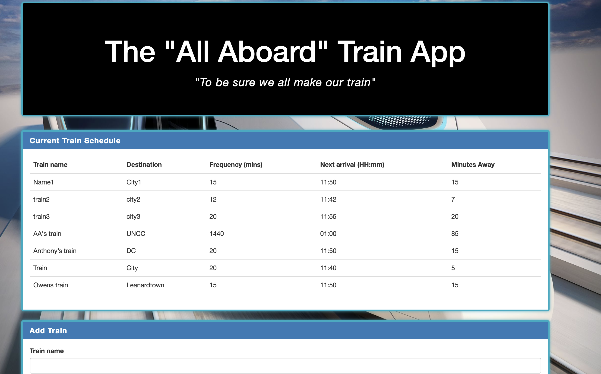
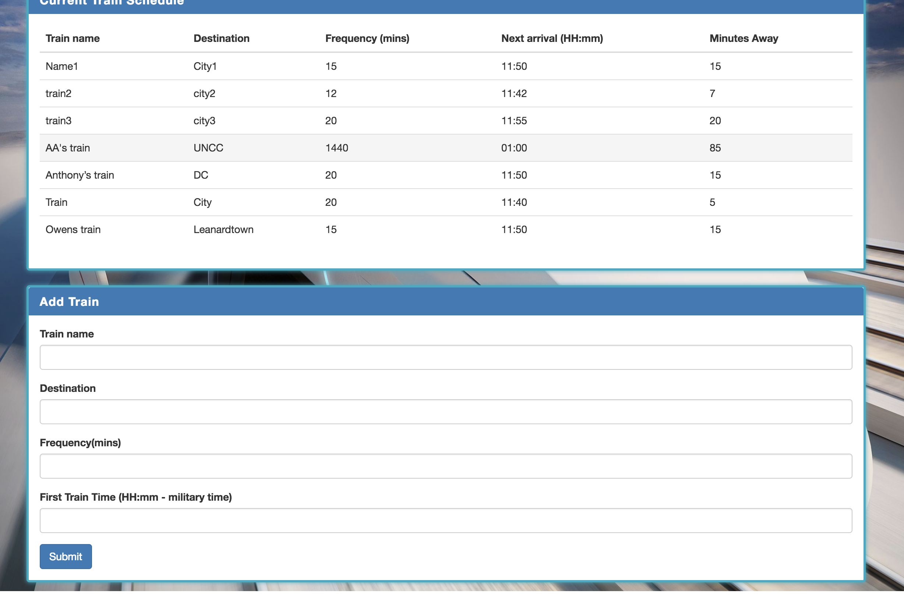

# TrainSchedule

https://mquade91.github.io/TrainSchedule/train.html

## 'All Aboard" Train app
### Allows users to view the current train schedule:
      -Train name	
      -Destination	
      -Frequency (mins)	
      -Next arrival (HH:mm)	
      -Minutes Away
      -As well as add another train to the schedule
    
 
### Train Schedule

### Add Train

